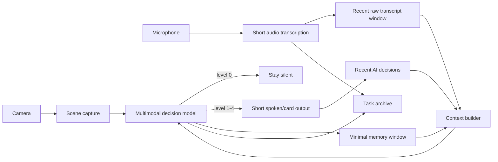

<div align="center">
  

# Sensory Firewall

**A context-aware multimodal attention filter for the real world.**

Instead of narrating everything it sees and hears, Sensory Firewall is designed to stay quiet by default and surface only information that is likely to change what the user should know or do.

`Expo` · `React Native` · `OpenAI Responses API` · `Speech-to-text` · `Human attention filtering`
</div>

---

## Why this exists

Most multimodal assistants optimize for *more output*. Sensory Firewall experiments with the opposite objective:

> **Can an AI observe a noisy environment continuously, maintain context over time, and speak only when the information is worth interrupting a person for?**

The prototype was built around classroom and everyday-information overload. It intentionally treats silence as the default successful outcome.

## Core idea



The model does **not** receive an ever-growing transcript. Precision mode uses two bounded context layers:

- **Recent raw transcript** for pronouns, unfinished explanations, and exact local wording.
- **Minimal memory summaries** for longer continuity such as deadlines, rules, location changes, required materials, and unresolved tasks.

Recent decisions are also included to reduce repeated interruptions.

## What it can do

- Camera + microphone multimodal analysis.
- Three cost/attention modes: **Economy**, **Balanced**, and **Precision**.
- Default-silent decision policy with five output levels (`0` silent → `4` alarm).
- Two-layer sliding context for short-term precision and longer continuity.
- Trigger-word mode that can enter Precision mode automatically.
- Continuous masking audio with ducking while the app speaks.
- Daily soft-budget guard for cloud calls.
- Task sessions with local transcript/decision archives.
- Local archive search by title, tags, summary, and optionally raw transcript.
- Temporary scene/audio files are deleted after each analysis attempt.

## Attention policy

The current policy deliberately suppresses ordinary social noise. It is biased toward surfacing information with concrete consequences, for example:

- deadlines and exam rules;
- room/location changes;
- required materials;
- school/administrative/payment information;
- information the user is actively missing that could cause a real loss;
- immediate physical hazards.

Ordinary faces, laughter, eye contact, tone, name-calling, and routine interaction are not treated as meaningful events by default.

## Precision context

Default limits:

| Layer | Default |
|---|---:|
| Recent raw transcript | 6 chunks / 4,500 chars |
| Minimal memory | 16 items / 2,200 chars |
| Recent decisions | 6 decisions |

This keeps continuity bounded instead of letting prompt size grow indefinitely.

## Trigger mode

Trigger mode periodically records a short audio chunk, transcribes it, and checks configurable keywords. On a hit it can:

1. play a short cue;
2. enter Precision mode;
3. open a task session;
4. immediately run one multimodal analysis.

**Current limitation:** trigger detection still uses cloud transcription and substring matching. A future version should move keyword spotting on-device so passive listening does not require a network call.

## Budget guard

The app tracks an **estimated** daily spend and stops automatic cloud work when the configured limit is reached.

This is intentionally a soft guard rather than billing-grade accounting: scene cost is configured as an estimate and transcription cost is approximated from duration/model.

## Project structure

```text
SensoryFirewall/
├── App.js                 # UI + runtime orchestration
├── src/
│   ├── config.js          # defaults, storage keys, mode configuration
│   ├── core.js            # context, parsing, archive, budget helpers
│   └── policy.js          # default-silent AI decision policy
├── assets/
│   ├── icon.png
│   ├── precision_cue.wav
│   └── white_noise.wav
├── docs/
│   └── ARCHITECTURE.md
├── app.json
├── package.json
└── .gitignore
```

The original prototype was intentionally fast-moving and concentrated most logic in `App.js`. This public version extracts the reusable state/context/policy helpers while keeping the runtime flow easy to inspect.

## Run locally

Requirements:

- Node.js
- Expo Go on an iPhone (or a supported simulator/device)
- an OpenAI API key for cloud features

```bash
npm install
npx expo start
```

Scan the Expo QR code, grant camera/microphone permission, then enter the API key in the app UI.

### Recommended first run

- Mode: **Economy**
- Trigger mode: **Off**
- Daily budget: **$0.20–$0.50**
- Use **Manual cloud analysis** before enabling automatic modes

## Privacy and security

This is a research/personal prototype, not a production privacy architecture.

- API keys are entered in the UI but intentionally **not persisted** by this public version; restarting the app clears the key.
- Captured image/audio files are intended to be temporary and are deleted after analysis attempts.
- Precision mode keeps bounded transcript/memory context in memory.
- Task Archive stores raw transcript text locally until deleted.
- Audio, images, and transcript context sent to cloud models leave the device.

For a production release, API calls should move behind a backend or another secure credential architecture. See [`SECURITY.md`](SECURITY.md) and [`PRIVACY.md`](PRIVACY.md).

## Safety limits

**Do not use this prototype as a safety-critical system.** It samples intermittently and depends on device state, network availability, model latency, and model correctness. It is not appropriate as the sole warning mechanism for driving, traffic, laboratories, kitchens, medical situations, or emergencies.

## Roadmap

- [ ] On-device keyword spotting for trigger mode
- [ ] SQLite-backed long-term task archive
- [ ] Real API usage accounting instead of fixed-cost estimates
- [ ] Stronger semantic memory deduplication and contradiction handling
- [ ] More runtime modules extracted from `App.js`
- [ ] Automated tests for context trimming, trigger matching, JSON parsing, budget gates, and archive behavior

## Status

**Prototype / portfolio project.** The interesting problem here is not “describe the camera feed.” It is the control problem of deciding **when information deserves human attention** while preserving enough state to make that decision over time.
