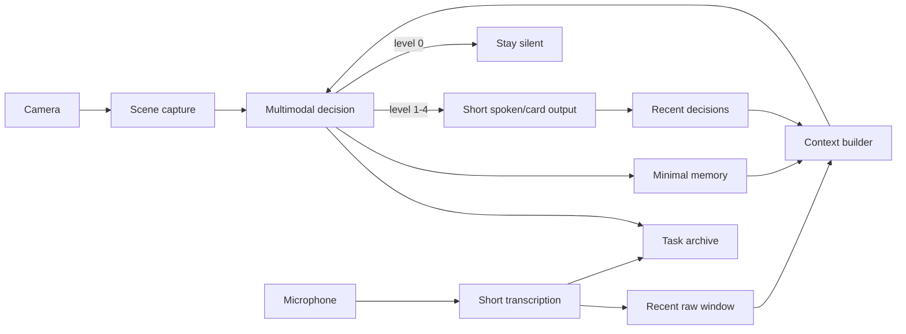

<div align="center">

<sub><strong>PROJECT 02 / ATTENTION SYSTEMS</strong></sub>

# Sensory Firewall

**Most assistants try to say more. Sensory Firewall tries to know when to say nothing.**

A context-aware multimodal attention filter for the real world.

`Expo` · `React Native` · `OpenAI Responses API` · `Speech-to-text` · `Human attention filtering`

</div>

---

## Design question

> **Can an AI observe a noisy environment continuously, preserve just enough context, and interrupt only when information changes what the user should know or do?**

Sensory Firewall is an experimental mobile assistant built around a default-silent policy. Instead of narrating everything it sees and hears, it treats **silence as a successful outcome**.

## System loop



The model never receives an indefinitely growing transcript. Precision mode uses bounded layers:

- **Recent raw transcript** for exact local wording, pronouns, and unfinished explanations.
- **Minimal memory summaries** for durable continuity such as deadlines, rules, location changes, required materials, and unresolved tasks.
- **Recent decisions** to reduce repeated interruptions.

## Highlights

- Camera + microphone multimodal analysis.
- Three attention/cost modes: **Economy**, **Balanced**, and **Precision**.
- Five output levels from `0` (silent) to `4` (alarm).
- Two-layer sliding context for local precision and longer continuity.
- Configurable trigger-word mode that can enter Precision automatically.
- Continuous masking audio with ducking while the app speaks.
- Daily soft-budget guard for cloud calls.
- Task sessions with local transcript and decision archives.
- Local archive search by title, tags, summary, and optionally raw transcript.
- Temporary scene/audio files are deleted after analysis attempts.

## Attention policy

The current policy deliberately suppresses ordinary social noise. It favors information with concrete consequences, including:

- deadlines and exam rules;
- room or location changes;
- required materials;
- administrative or payment information;
- information the user is actively missing that could cause a real loss;
- immediate physical hazards.

Faces, laughter, eye contact, tone, name-calling, and routine interaction are not treated as meaningful events by default.

## Precision context

| Layer | Default |
|---|---:|
| Recent raw transcript | 6 chunks / 4,500 chars |
| Minimal memory | 16 items / 2,200 chars |
| Recent decisions | 6 decisions |

The objective is bounded continuity rather than an ever-growing prompt.

## Trigger mode

Trigger mode periodically records a short audio chunk, transcribes it, and checks user-configured keywords. On a hit it can play a cue, enter Precision mode, open a task session, and immediately run one multimodal analysis.

**Current limitation:** trigger detection still depends on cloud transcription and substring matching. A future version should move keyword spotting on-device.

## Project structure

```text
sensory-firewall/
├── App.js
├── src/
│   ├── config.js
│   ├── core.js
│   └── policy.js
├── assets/
│   ├── icon.png
│   ├── precision_cue.wav
│   └── white_noise.wav
├── docs/
│   └── ARCHITECTURE.md
├── app.json
├── package.json
└── .gitignore
```

The prototype was intentionally fast-moving and still keeps runtime orchestration in `App.js`; reusable state, context, and policy logic live under `src/`.

## Run locally

Requirements:

- Node.js
- Expo Go on an iPhone, or a supported simulator/device
- an OpenAI API key for cloud features

```bash
npm install
npx expo start
```

Grant camera and microphone permission, then enter the API key in the app UI.

Recommended first run: **Economy mode**, trigger mode off, and manual cloud analysis before enabling automatic modes.

## Privacy and security

This is a research/personal prototype, not a production privacy architecture.

- API keys are entered in the UI and intentionally **not persisted**.
- Captured image/audio files are intended to be temporary and are deleted after analysis attempts.
- Precision mode keeps bounded transcript/memory context in memory.
- Task Archive stores raw transcript text locally until deleted.
- Audio, images, and transcript context sent to cloud models leave the device.

See [`SECURITY.md`](SECURITY.md) and [`PRIVACY.md`](PRIVACY.md).

## Safety limits

**Do not use this prototype as a safety-critical system.** It samples intermittently and depends on device state, network availability, model latency, and model correctness. It is not appropriate as the sole warning mechanism for driving, traffic, laboratories, kitchens, medical situations, or emergencies.

## Roadmap

- [ ] On-device keyword spotting
- [ ] SQLite-backed long-term task archive
- [ ] Real API usage accounting
- [ ] Stronger semantic-memory deduplication and contradiction handling
- [ ] Further runtime modularization
- [ ] Automated tests for context trimming, trigger matching, JSON parsing, budget gates, and archive behavior

## Status

**Prototype / portfolio project.**

The core problem is not “describe the camera feed.” It is deciding **when information deserves human attention** while preserving enough state to make that decision over time.
